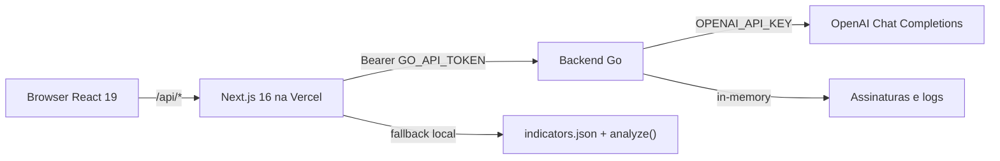

# Seu Sinval — Governança de dados e IA

Painel executivo de privacidade, proteção de dados, governança e riscos de IA, com chat de quatro agentes especialistas. Protótipo conceitual com dados demonstrativos de agosto de 2026. A chave da OpenAI permanece apenas no backend Go.

## Visão geral

- **Nome:** Seu Sinval
- **Propósito de negócio:** dar a um head de governança, privacidade, segurança ou risco uma visão única do que está na meta, em atenção ou crítico — e um assistente que explica o recorte sem inventar evidência.
- **Problema que resolve:** indicadores de LGPD, proteção, governança e IA costumam viver em planilhas e sistemas separados. O painel concentra 22 indicadores fictícios, prioriza desvios, explica a previsão Holt e permite acompanhar por e-mail.
- **Público-alvo:** executivos e especialistas de governança de dados, privacidade, segurança da informação e risco de IA. Não é um produto jurídico nem um motor de conformidade.
- **Principais funcionalidades:**
  - Visão geral executiva com KPIs, ação agora, prioridades, panorama por domínio, gráfico Holt e tabela.
  - Quatro visões de domínio (Privacidade, Proteção, Riscos de IA, Governança de dados).
  - Central de alertas com modo de foco por status.
  - Filtros persistidos na URL (`domain`, `status`, `q`).
  - Detalhe do indicador com histórico, previsão explicável e assinatura por e-mail.
  - Chat flutuante com Seu Sinval, Aurora, Octave e Sherlock (streaming SSE ou simulação local).
  - Tema claro/escuro persistido.
  - Meus acompanhamentos: CRUD de assinaturas, pausa/retomada, simulação e histórico.

## Demonstração do funcionamento

O frontend é uma SPA Next.js. A navegação principal não troca de rota de página, exceto `/alertas`. O estado de visão, domínio, status e busca vive em `app/page.tsx` e é espelhado na query string.

### Fluxos do usuário

1. **Abrir o painel**
   - Carrega `GET /api/indicators`. Sem backend Go, usa `backend/indicators.json` em modo `demo`.
   - Mostra skeleton (`DashboardSkeleton`) até a primeira resposta.
   - Breadcrumb: `Governança`. Título: `Governança`.

2. **Selecionar um domínio**
   - Menu lateral, cards de domínio ou URL `/?domain=governanca`.
   - Recorta KPIs, ação agora, prioridades, gráfico e tabela para aquele domínio.
   - Breadcrumb: `Governança > Governança de dados`.

3. **Ver prioridades / Ver em atenção**
   - A partir de um domínio, os CTAs dos KPIs navegam para a Central de alertas **preservando o domínio**.
   - URL resultante: `/alertas?domain=governanca&status=critical` ou `status=attention`.
   - Título: `Governança de dados · Central de alertas (crítico)` ou `(atenção)`.
   - Cards-resumo superiores somem. Só a lista filtrada sobe para a área principal.
   - Chip ativo: `3 Atenção` (contagem + status).
   - Indicadores de outros status ou de outros domínios não aparecem.

4. **Limpar filtros**
   - Na Central de alertas, `Limpar filtros` volta à visão completa **do mesmo domínio**, com cards-resumo.
   - Na tabela, `Limpar filtro` zera busca e situação.

5. **Atualizar a página**
   - `readUrlState()` lê `pathname`, `domain`, `status` e `q` e reconstrói view/filtro.
   - Aceita slugs curtos (`governanca`) e longos (`governanca-de-dados`).

6. **Abrir detalhe**
   - Clique em linha da tabela, alerta, prioridade ou “Ação agora”.
   - Sheet lateral com valor, meta, responsável, fonte, histórico, previsão Holt e botão **Acompanhar por e-mail**.

7. **Conversar com um agente**
   - FAB no canto inferior direito, botão do header, galeria de agentes ou “Perguntar ao Seu Sinval”.
   - Painel aberto: desktop 440–480 × 620–680 px; mobile quase full-width com margens.
   - Cabeçalho fixo (avatar, nome, minimizar, fechar), mensagens com scroll interno, input fixo.
   - Sem `GO_API_URL`, a rota `/api/chat` devolve simulação local identificada (`simulated: true`).

8. **Assinar um indicador**
   - Botão na tabela ou no detalhe abre `Meus acompanhamentos` com o ID pré-selecionado.
   - CRUD, pausa/retomada, simular notificação e histórico. Sem backend Go, a API devolve 503.

### Regras de filtro (obrigatórias)

| Estado | URL | Cards-resumo | Lista |
| --- | --- | --- | --- |
| Visão geral | `/` | 4 KPIs do painel | todos os indicadores |
| Domínio | `/?domain=governanca` | KPIs do domínio | só aquele domínio |
| Alertas do domínio | `/alertas?domain=governanca` | 3 cards (crítico / atenção / na meta) | alertas abertos do domínio |
| Foco atenção | `/alertas?domain=governanca&status=attention` | ocultos | só atenção daquele domínio |
| Foco crítico | `/alertas?domain=governanca&status=critical` | ocultos | só críticos daquele domínio |
| Alertas gerais | `/alertas?status=attention` | ocultos | atenção de todos os domínios |

Slugs de domínio gravados: `privacidade`, `protecao`, `ia`, `governanca`. Slugs de status: `ok`, `attention`, `critical`.

Não há exportação de Excel, PDF ou imagem neste repositório.

## Arquitetura



- **Frontend:** Next.js 16.2.6 (App Router), React 19, Tailwind CSS 4, Recharts, Lucide, next-themes, Radix UI (sidebar/sheet).
- **Backend:** Go 1.22+, HTTP nativo, sem framework e sem banco persistente.
- **IA:** OpenAI Chat Completions apenas no Go. Sem `NEXT_PUBLIC_` / `VITE_` para a chave.
- **Dados:** 22 indicadores embarcados em `backend/indicators.json`. Assinaturas em memória.
- **Auth:** token de serviço (`API_TOKEN` / `GO_API_TOKEN`). Sem login de usuário; demo usa `usuario@seusinval.local`.
- **Deploy:** frontend na Vercel (`vercel.json` usa `next build`). Backend em qualquer host HTTPS (Dockerfile incluso).

### Decisões técnicas

- SPA única em `app/page.tsx` para preservar contexto de domínio/filtro sem perder estado de chat.
- Proxy Next.js para o Go, para a chave OpenAI nunca chegar ao browser.
- Holt determinístico (α=0,45; β=0,25) replicado em TypeScript e Go, para o painel funcionar offline.
- Tokens semânticos em `app/globals.css` para contraste WCAG em claro/escuro.
- Chat flutuante único (`FloatingChat`); o sheet legado `SinvalChat` foi removido.

## Estrutura detalhada do repositório

```
seu-sinval/
├── app/
│   ├── layout.tsx                 # html pt-BR, ThemeProvider, metadata
│   ├── page.tsx                   # estado, navegação, URL, montagem das telas
│   ├── globals.css                # design system e tokens
│   ├── alertas/page.tsx           # reexporta a página principal (rota /alertas)
│   └── api/
│       ├── agents/route.ts
│       ├── chat/route.ts          # proxy SSE + simulação local
│       ├── indicators/route.ts
│       ├── notifications/route.ts
│       └── subscriptions/route.ts
├── components/
│   ├── governance/                # UI de produto
│   ├── ui/                        # sidebar, sheet, button, input, tooltip, separator, skeleton
│   ├── theme-provider.tsx
│   └── theme-toggle.tsx
├── lib/
│   ├── agents.ts                  # catálogo dos 4 bots
│   ├── forecast.ts                # Holt TS
│   ├── go-proxy.ts                # GO_API_URL / GO_API_TOKEN
│   ├── indicators.ts              # tipos, status(), analyze()
│   ├── presentation.ts            # rótulos, slugs, textos, série do gráfico
│   ├── subscriptions.ts           # tipos e labels de eventos
│   └── utils.ts                   # cn()
├── hooks/use-mobile.ts
├── public/images/agents/          # retratos PNG
├── backend/
│   ├── main.go                    # HTTP, auth, SSE, healthz
│   ├── indicators.json            # 22 indicadores, 18 meses
│   ├── Dockerfile
│   └── internal/
│       ├── ai/                    # prompts, router, client, rate limit
│       ├── forecast/              # Holt Go
│       └── subscriptions/         # CRUD, mock e-mail, auditoria
├── tests/
│   ├── interactions.test.mjs
│   └── presentation.test.mjs
├── .env.example
├── vercel.json
└── README.md
```

### Componentes de governança

| Arquivo | Responsabilidade |
| --- | --- |
| `app-sidebar.tsx` | Menu: visão geral, 4 domínios, central de alertas, meus acompanhamentos, abrir Sinval |
| `kpi-card.tsx` | KPI com CTA condicional (`surface-hover` só se houver ação) |
| `action-now.tsx` | Lista curta de críticos/atenção |
| `priorities.tsx` | Ações recomendadas |
| `domain-cards.tsx` | Panorama dos 4 domínios |
| `alert-list.tsx` | Central de alertas, chip de foco, limpar filtros |
| `indicator-table.tsx` | Busca, filtro de situação, sparkline, assinar |
| `indicator-detail.tsx` | Sheet de detalhe + explainer Holt |
| `forecast-explainer.tsx` | Método, confiança, limitações |
| `trend-chart.tsx` | Histórico 12 meses + horizonte 3 meses (lazy) |
| `floating-chat.tsx` | FAB / minimizado / aberto, troca de agente, streaming |
| `agents-gallery.tsx` | Cards dos especialistas |
| `subscriptions-panel.tsx` | CRUD de acompanhamentos |
| `status-badge.tsx` / `status-filter.tsx` | Situação visual e chips |
| `panel.tsx` | Superfície reutilizável de seção |

## Funcionalidades detalhadas

### Classificação de status

Para cada indicador:

```
gap = direction === 'up' ? target - value : value - target
se gap <= 0            → Na meta
se unit === '' ou gap > 10 → Crítico   (contagens/incidentes com meta 0 também)
senão                  → Atenção     (déficit até 10 p.p.)
```

Percentuais: maior é melhor. Incidentes: menor é melhor. Qualquer incidente > 0 é crítico.

### Previsão Holt

- Histórico: 18 meses (`Mar/25` … `Ago/26`).
- Horizonte: `Set/26`, `Out/26`, `Nov/26`.
- α=0,45; β=0,25; faixa de 80% via RMSE in-sample × 1,28155.
- Sem aleatoriedade. Identificada como ilustração, sem validação preditiva.
- O detalhe mostra o painel **Como esta previsão foi calculada?**.

### Chat / IA

Entrada: `message` ou `question` (1–2000 caracteres), `agent`, `conversationId`, `domain`, `context.currentPage`, `context.selectedIndicator`, `stream`.

Roteamento (`backend/internal/ai/router.go`):

- Se o usuário escolheu Aurora, Octave ou Sherlock, a escolha é respeitada.
- Com Seu Sinval, a pergunta + página + domínio classificam o assunto. Multidisciplinar permanece no coordenador.

Streaming SSE: eventos `meta`, `delta`, `done`, `error`.

Fallback local: `analyze()` em `lib/indicators.ts` + prefixo “simulação local, sem motor OpenAI”.

Disclaimer sempre anexado: *As respostas são orientativas e devem ser validadas pelas áreas de Privacidade, Segurança, Risco e Jurídico.*

### Assinaturas

Eventos: `data_update`, `criticality_change`, `became_critical`, `trend_decline`, `forecast_available`.

Frequências: `immediate`, `daily`, `weekly`.

E-mail: `MockSender` em memória + HTML corporativo. Interface `Sender` pronta para SES/Resend/SendGrid. Sem provedor real configurado.

Usuário demo: id `demo`, e-mail `usuario@seusinval.local`.

### Tema e acessibilidade

- `next-themes` com `attribute="class"`, `defaultTheme="system"`.
- Tokens `--surface`, `--text-primary`, `--text-muted`, `--danger`, etc. em claro e escuro.
- Status nunca depende só de cor (ícone + texto).
- Chat e sidebar têm labels ARIA, `aria-pressed` nos filtros, foco visível.

## Instalação e execução local

### Pré-requisitos

- Node.js **≥ 22.13**
- npm 10+
- Go **≥ 1.22** (1.24 no Dockerfile)
- Opcional: chave OpenAI, Docker, Vercel CLI

### Frontend

```powershell
npm install
copy .env.example .env.local
npx next dev
```

Abre em `http://localhost:3000`. Sem Go, o painel funciona em modo demo e o chat simula respostas.

### Backend

```powershell
cd backend
$env:API_TOKEN="um-segredo-com-pelo-menos-24-chars"
$env:OPENAI_API_KEY="sk-..."          # opcional
$env:OPENAI_MODEL="gpt-4o-mini"       # opcional
$env:PORT="8080"
$env:PORTAL_URL="http://localhost:3000"
go test ./...
go run .
```

No `.env.local` do frontend:

```
GO_API_URL=http://localhost:8080
GO_API_TOKEN=um-segredo-com-pelo-menos-24-chars
```

Reinicie o Next.js depois de alterar env.

### Docker do backend

```powershell
cd backend
docker build -t seu-sinval .
docker run -p 8080:8080 -e API_TOKEN=um-segredo-com-pelo-menos-24-chars -e OPENAI_API_KEY=sk-... seu-sinval
```

### Testes, lint e build

```powershell
npm test
npm run typecheck
npm run lint
npm run build

cd backend
go test ./...
```

### Deploy

1. Publique o Go em host HTTPS com `API_TOKEN` e `OPENAI_API_KEY`.
2. Na Vercel, defina só `GO_API_URL` e `GO_API_TOKEN`.
3. `npx vercel --prod` ou push em `main`.

O site continua no ar sem o Go (painel demonstrativo). O chat com IA só responde depois que o backend estiver publicado.

## Configuração

| Variável | Camada | Obrigatória | Descrição | Exemplo seguro |
| --- | --- | --- | --- | --- |
| `GO_API_URL` | Frontend | não | Origem HTTPS do Go | `http://localhost:8080` |
| `GO_API_TOKEN` | Frontend | se houver Go | Mesmo valor de `API_TOKEN` | `um-segredo-com-pelo-menos-24-chars` |
| `API_TOKEN` | Backend | sim | Bearer, mínimo 24 caracteres | `um-segredo-com-pelo-menos-24-chars` |
| `OPENAI_API_KEY` | Backend | para chat LLM | Chave OpenAI. Nunca no frontend. | *(vazio no example)* |
| `OPENAI_MODEL` | Backend | não | Padrão `gpt-4o-mini` | `gpt-4o-mini` |
| `PORT` | Backend | não | Padrão `8080` | `8080` |
| `PORTAL_URL` | Backend | não | Base dos links de e-mail | `http://localhost:3000` |

Arquivos: `.env.example` (raiz) e `backend/.env.example`. Não commitar `.env` / `.env.local`.

## Contratos e dados

### Indicador

```json
{
  "id": "GOV-001",
  "name": "Índice de governança de dados",
  "domain": "Governança de dados",
  "unitArea": "Escritório de dados",
  "value": 78,
  "previous": 76,
  "target": 85,
  "unit": "%",
  "direction": "up",
  "owner": "Escritório de dados",
  "source": "Escritório de dados",
  "numerator": 78,
  "denominator": 100,
  "action": "Fechar os controles pendentes de qualidade e catalogação neste ciclo.",
  "history": [62, 63, "...18 números"],
  "updatedAt": "2026-08-31T18:00:00-03:00",
  "records": 100,
  "criticality": "alta"
}
```

22 itens: PRV-001…006, PRO-001…006, IA-001…006, GOV-001…004. Período de referência: agosto de 2026.

### Endpoints Go

Autenticação: `Authorization: Bearer <API_TOKEN>` em todas as rotas, **exceto** `GET /healthz`.

| Método | Caminho | Função |
| --- | --- | --- |
| GET | `/healthz` | `{ "status": "ok", "mode": "demo" \| "llm" }` |
| GET | `/api/indicators` | indicadores + forecast Holt |
| GET | `/api/agents` | catálogo e status |
| POST | `/api/chat` | chat JSON ou SSE |
| GET/POST | `/api/subscriptions` | listar / criar |
| GET/PATCH/DELETE | `/api/subscriptions/{id}` | ler / atualizar / apagar |
| POST | `/api/subscriptions/{id}/pause` | pausar |
| POST | `/api/subscriptions/{id}/resume` | retomar |
| GET | `/api/subscriptions/history` | logs |
| POST | `/api/notifications/simulate` | dispara e-mail mock |
| POST | `/api/subscriptions/unsubscribe` | token de descadastro |

Proxy Next.js: `/api/indicators`, `/api/agents`, `/api/chat`, `/api/subscriptions`, `/api/notifications`.

#### POST `/api/chat`

```json
{
  "message": "Quais são os riscos de usar IA generativa no atendimento?",
  "agent": "sinval",
  "conversationId": "",
  "domain": "Riscos de IA",
  "context": { "selectedIndicator": "IA-001", "currentPage": "Riscos de IA" },
  "stream": true
}
```

Resposta JSON:

```json
{
  "conversationId": "...",
  "agent": { "id": "aurora", "name": "Aurora", "role": "Especialista em Risco de IA" },
  "message": "...",
  "suggestedActions": ["Quais riscos de IA estão críticos?"],
  "disclaimer": "As respostas são orientativas..."
}
```

Erros: `400` JSON/pergunta inválida, `401` token, `429` rate limit (20/IP/min), `502`/`503` IA indisponível. Mensagens públicas, sem vazar chave.

#### POST `/api/subscriptions`

```json
{
  "indicatorId": "GOV-001",
  "indicatorName": "Índice de governança de dados",
  "email": "usuario@seusinval.local",
  "events": ["became_critical", "data_update"],
  "frequency": "immediate"
}
```

## Guia para uma IA recriar o projeto

Esta seção é a especificação de implementação. Recrie o sistema nesta ordem.

### 0. Essencial — não omitir

- 22 indicadores fictícios de agosto de 2026, 18 meses de histórico.
- Quatro domínios e quatro agentes (Sinval, Aurora, Octave, Sherlock).
- Regras de status (meta / atenção ≤10 p.p. / crítico).
- Holt α=0,45 β=0,25, horizonte 3 meses, faixa 80%.
- OpenAI **somente** no backend Go.
- Preservação de domínio ao abrir prioridades/atenção.
- Modo de foco na Central de alertas (ocultar cards-resumo).
- Persistência de filtros na URL.
- Chat flutuante único, header/footer fixos, scroll interno.
- Tema claro/escuro com tokens semânticos.
- Identidade: laranja `#ec7000`, azul-marinho `#08244a`, retratos em `public/images/agents/`.
- Disclaimer jurídico no chat.
- Sem inventar dados, políticas internas ou conclusão de conformidade.

### 1. Dados e regras

1. Copiar o contrato do indicador.
2. Implementar `status()`, `gap()`, `forecastSeries()` em TS e Go com os mesmos números.
3. Embarcar `indicators.json` no binário Go (`//go:embed`).

### 2. Backend Go

1. `GET /healthz`, `GET /api/indicators`, `GET /api/agents`, `POST /api/chat`.
2. Bearer token, rate limit 20/min, timeout 40s na OpenAI, shutdown gracioso.
3. Prompts versionados + guardrails em português.
4. Router de agentes.
5. SSE `meta` / `delta` / `done` / `error`.
6. Módulo de assinaturas in-memory + `MockSender`.

### 3. Frontend Next.js

1. `app/layout.tsx` + `ThemeProvider`.
2. `app/globals.css` com tokens de marca, status, superfície e dark mode.
3. `app/page.tsx` como único orquestrador de estado (`view`, `filter`, `alertDomain`, `query`, chat, selected).
4. `readUrlState()` + `history.replaceState` para `/` e `/alertas`.
5. Componentes da tabela da seção de estrutura.
6. Rotas `app/api/*` como proxy (`lib/go-proxy.ts`).
7. `FloatingChat` com estados closed / minimized / open.

### 4. Design

- Tipografia do sistema, `antialiased`, números em `font-variant-numeric`.
- Superfícies `rounded-2xl`, sombra `--shadow-1/2/3`.
- Sidebar 260px, topbar sticky 64px.
- Chat desktop: `min-w-[440px]`, `w-[min(480px,calc(100vw-2rem))]`, `h-[min(680px,calc(100dvh-2rem))]`, `min-h-[620px]`.
- Mobile: `inset-x-3 bottom-3`, altura `min(640px, 100dvh - 2rem)`.
- Cores de domínio: privacidade `#ec7000`, proteção `#1754a1`, IA `#6f4fb3`, governança `#0c3364`.
- Acentos dos agentes: Sinval `#08244a`, Aurora `#6f4fb3`, Octave `#1754a1`, Sherlock `#ec7000`.

### 5. Comportamento de filtros (aceitação objetiva)

Para cada domínio:

1. Selecionar o domínio.
2. Clicar **Ver prioridades** → só críticos daquele domínio; cards-resumo ocultos; URL `/alertas?domain=<slug>&status=critical`.
3. Voltar / limpar.
4. Clicar **Ver em atenção** → só atenção daquele domínio; cards-resumo ocultos.
5. Atualizar a página → filtro permanece.
6. **Limpar filtros** → visão completa do domínio, cards-resumo de volta.

Na visão geral, os mesmos botões mostram todos os domínios.

### 6. Critérios de aceite da réplica

- [ ] `npx tsc --noEmit` passa.
- [ ] `npx next build` gera `/`, `/alertas` e as rotas `/api/*`.
- [ ] `go test ./...` passa.
- [ ] 22 indicadores, 18 pontos de histórico.
- [ ] Quatro agentes com avatares e cores corretas.
- [ ] Sem `OPENAI_API_KEY` no bundle do frontend.
- [ ] Chat simula localmente se o Go não estiver configurado.
- [ ] Tema claro/escuro persiste.
- [ ] Modo de foco da Central de alertas conforme a tabela de filtros.
- [ ] Assinaturas criam, listam, pausam e simulam notificação com o Go no ar.
- [ ] Nenhum fluxo existente (tabela, detalhe, gráfico, galeria, sidebar) foi omitido.

### 7. O que não fazer

- Não colocar a chave OpenAI no Vercel nem em `NEXT_PUBLIC_`.
- Não tratar os dados como reais ou como evidência de conformidade.
- Não reintroduzir Vite, vinext, Wrangler, Drizzle ou o kit shadcn completo — o produto roda em Next.js.
- Não criar um segundo chat (sheet) além do flutuante.

## Qualidade e manutenção

- TypeScript strict no frontend; Go com testes de roteamento, prompts, auth e CRUD de assinaturas.
- Testes Node (`tests/*.test.mjs`) cobrem interações de fonte, catálogo de agentes, ausência de chave OpenAI no frontend, Holt/presentation e os 22 indicadores.
- ESLint: `eslint-config-next`. Arquivos vendored em `components/ui` têm regras de unused-vars relaxadas.
- Commits: não há convenção enforced; descreva a mudança de produto em português.
- Evolução futura:
  - Trocar `MockSender` por SES/Resend.
  - Persistência real de assinaturas (hoje in-memory).
  - Autenticação de usuário (hoje demo).
  - Cache SWR/React Query se a base crescer.
- Limitações conhecidas:
  - Dados e metas são fictícios.
  - Sem exportação Excel/PDF/imagem.
  - Sem banco; restart do Go zera assinaturas e histórico de chat.
  - Windows: scripts bash do antigo starter foram removidos; use `npx next dev` / `npx next build`.
  - `npm run lint` no repositório inteiro ainda herda ruído de `node_modules` se o ignore falhar; prefira lintar os arquivos alterados.

## Verificação rápida

```powershell
npm test
npm run typecheck
npx eslint app components lib tests --ignore-pattern dist --ignore-pattern .next
npx next build
cd backend
go test ./...
```
